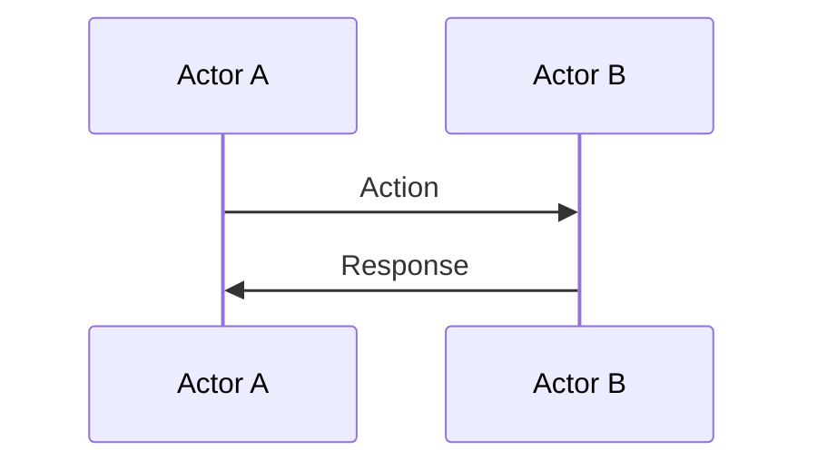
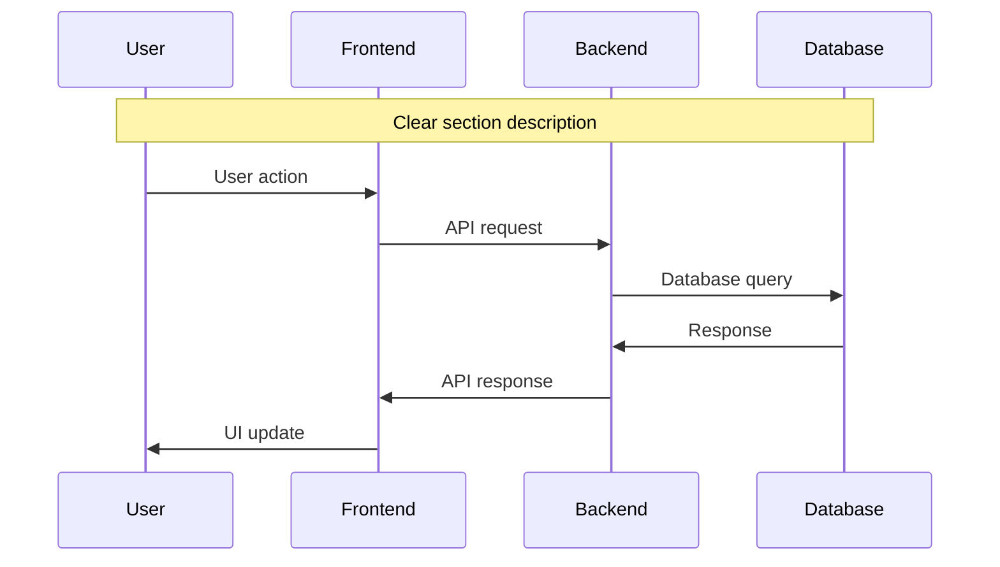

# Documentation Setup Guide

This guide explains how to set up and use the MkDocs documentation for the 3D Educational Visualization Platform.

## 🚀 Quick Start

### Prerequisites
- Python 3.11+ with uv package manager
- MkDocs and MkDocs Material theme (already installed)

### Starting the Documentation Server

1. **Using the provided script:**
   ```bash
   ./serve-docs.sh
   ```

2. **Manual start:**
   ```bash
   cd backend
   uv run mkdocs serve --config-file ../mkdocs.yml --dev-addr=127.0.0.1:8001
   ```

3. **Open your browser:**
   Navigate to `http://127.0.0.1:8001`

## 📁 Documentation Structure

```
docs/
├── index.md                    # Home page and navigation
├── README.md                   # System overview and architecture
├── enhance-prompt-flow.md      # AI prompt enhancement flow
├── generate-visualization-flow.md # Core 3D generation with RAG
├── show-retrieved-results-flow.md # RAG debugging tools
└── add-gold-standards-flow.md  # Educational content management
```

## 🎨 Features

### Mermaid Diagrams
All sequence diagrams are rendered using Mermaid.js:
- Interactive diagrams
- Responsive design
- Custom styling
- Export capabilities

### Material Theme
- Modern, responsive design
- Dark/light mode toggle
- Search functionality
- Navigation sidebar
- Mobile-friendly

### Code Highlighting
- Syntax highlighting for multiple languages
- Copy-to-clipboard functionality
- Line numbers
- Code annotations

## 🔧 Configuration

### MkDocs Configuration (`mkdocs.yml`)
- **Theme**: Material Design
- **Plugins**: Search, Mermaid2
- **Extensions**: Multiple Markdown extensions
- **Navigation**: Hierarchical structure

### Custom Styling (`stylesheets/extra.css`)
- Custom Mermaid diagram styling
- Enhanced code block appearance
- Responsive design improvements
- Print-friendly styles

## 📝 Adding New Documentation

### 1. Create a new Markdown file in `docs/`
```markdown
# New Flow Documentation

## Overview
Brief description of the flow.

## Sequence Diagram


## Key Components
- Component 1: Description
- Component 2: Description

## Benefits
1. Benefit 1
2. Benefit 2
```

### 2. Update navigation in `mkdocs.yml`
```yaml
nav:
  - Home: index.md
  - System Overview: README.md
  - Core Flows:
    - New Flow: new-flow.md  # Add your new file here
```

### 3. Build and test
```bash
cd backend
uv run mkdocs build --config-file ../mkdocs.yml
```

## 🛠️ Development

### Building Static Site
```bash
cd backend
uv run mkdocs build --config-file ../mkdocs.yml
```
The static site will be generated in the `site/` directory.

### Live Reload
When using `mkdocs serve`, the site automatically reloads when you make changes to the documentation files.

### Custom CSS/JS
- **CSS**: Add styles to `stylesheets/extra.css`
- **JavaScript**: Add scripts to `javascripts/`

## 📊 Mermaid Diagram Tips

### Best Practices
1. **Clear participant names**: Use descriptive abbreviations
2. **Detailed notes**: Explain complex steps
3. **Consistent styling**: Use the same color scheme
4. **Responsive design**: Keep diagrams readable on mobile

### Example Structure


## 🔍 Troubleshooting

### Common Issues

1. **Mermaid diagrams not rendering**
   - Check that the mermaid2 plugin is installed
   - Verify the code fence syntax: ` ```mermaid `

2. **Navigation not working**
   - Check file paths in `mkdocs.yml`
   - Ensure files exist in the `docs/` directory

3. **Styling not applied**
   - Verify `stylesheets/extra.css` is included
   - Check browser cache

4. **Build errors**
   - Check for syntax errors in Markdown
   - Verify YAML syntax in `mkdocs.yml`

### Debug Commands
```bash
# Check MkDocs version
uv run mkdocs --version

# Validate configuration
uv run mkdocs build --config-file ../mkdocs.yml --strict

# Clean build
rm -rf site/
uv run mkdocs build --config-file ../mkdocs.yml
```

## 📚 Additional Resources

- [MkDocs Documentation](https://www.mkdocs.org/)
- [Material for MkDocs](https://squidfunk.github.io/mkdocs-material/)
- [Mermaid Documentation](https://mermaid.js.org/)
- [Markdown Guide](https://www.markdownguide.org/)

## 🤝 Contributing

When contributing to the documentation:

1. **Follow the existing structure**
2. **Use Mermaid for sequence diagrams**
3. **Include comprehensive examples**
4. **Test the build locally**
5. **Update the navigation if needed**

## 📞 Support

For documentation issues:
1. Check the troubleshooting section
2. Review MkDocs and Material theme documentation
3. Contact the development team 