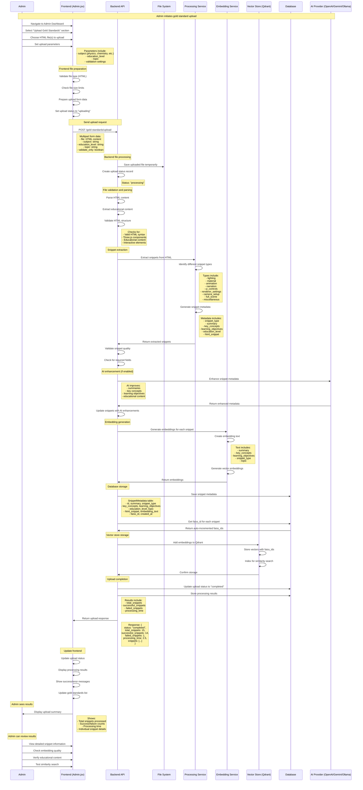

# Add Gold Standards Flow

This document describes the sequence of interactions when an administrator uploads and processes gold standard educational content in the 3D Educational Visualization Platform.

## Overview

The add gold standards flow allows administrators to upload high-quality educational HTML files, process them into snippets, generate embeddings, and store them in the vector database for use in retrieval-augmented generation (RAG).

## Sequence Diagram



## Key Components

### Frontend (Admin.jsx)
- **File Upload**: Handles HTML file selection and upload
- **Progress Tracking**: Shows upload and processing progress
- **Result Display**: Shows processing results and snippet details
- **Error Handling**: Displays validation and processing errors

### Backend API (/gold-standards/upload)
- **File Processing**: Parses and validates HTML content
- **Snippet Extraction**: Identifies and extracts different snippet types
- **AI Enhancement**: Uses AI to improve metadata quality
- **Embedding Generation**: Creates vector embeddings for similarity search
- **Database Storage**: Saves metadata and links to vector store

### Processing Service
- **HTML Parsing**: Extracts educational content from HTML
- **Snippet Classification**: Identifies different types of code snippets
- **Metadata Generation**: Creates comprehensive metadata for each snippet
- **Quality Validation**: Ensures snippets meet educational standards

### Embedding Service
- **Text Preparation**: Creates embedding text from metadata
- **Vector Generation**: Converts text to high-dimensional vectors
- **Normalization**: Ensures consistent embedding format

### Vector Store (Qdrant)
- **Vector Storage**: Stores embeddings with unique IDs
- **Indexing**: Creates searchable index for similarity queries
- **ID Management**: Links vector IDs to database records

## File Processing Pipeline

### 1. HTML Validation
```javascript
// Validate HTML structure
const htmlContent = await file.text();
const isValid = validateHTML(htmlContent);
if (!isValid) {
    throw new Error("Invalid HTML structure");
}
```

### 2. Snippet Extraction
```javascript
// Extract different snippet types
const snippets = extractSnippets(htmlContent);
// Types: lighting, material, animation, narration, ui_controls, etc.
```

### 3. Metadata Generation
```javascript
// Generate metadata for each snippet
const metadata = {
    snippet_type: "ui_controls",
    summary: "Mouse drag controls for charge spheres",
    key_concepts: "Electric charge, Coulomb's law",
    learning_objectives: "Understand electric field interactions",
    education_level: "High School",
    html_snippet: "function onMouseDown(event) {...}"
};
```

### 4. AI Enhancement
```javascript
// Enhance metadata with AI
const enhanced = await enhanceMetadata(metadata);
// Improves summaries, concepts, and educational content
```

### 5. Embedding Generation
```javascript
// Create embedding text
const embeddingText = createEmbeddingText(metadata);
// Generate vector
const embedding = await generateEmbedding(embeddingText);
```

## Database Schema

### SnippetMetadata Table
```sql
CREATE TABLE snippet_metadata (
    id VARCHAR PRIMARY KEY,
    summary TEXT,
    snippet_type VARCHAR,
    key_concepts TEXT,
    learning_objectives TEXT,
    education_level VARCHAR,
    topic VARCHAR,
    html_snippet TEXT,
    embedding_text TEXT,
    faiss_id INTEGER UNIQUE,
    created_at TIMESTAMP,
    updated_at TIMESTAMP
);
```

### GoldStandardUploadStatus Table
```sql
CREATE TABLE gold_standard_upload_status (
    id VARCHAR PRIMARY KEY,
    filename VARCHAR,
    subject VARCHAR,
    education_level VARCHAR,
    topic VARCHAR,
    status VARCHAR,
    total_snippets INTEGER,
    successful_snippets INTEGER,
    failed_snippets INTEGER,
    processing_time FLOAT,
    result JSON,
    created_at TIMESTAMP
);
```

## Validation Rules

### HTML Content Validation
- **Valid HTML**: Must be well-formed HTML
- **Three.js Components**: Must contain Three.js scene elements
- **Educational Content**: Must have educational value
- **Interactive Elements**: Should include interactive features

### Snippet Quality Validation
- **Required Fields**: summary, snippet_type, key_concepts
- **Content Length**: Minimum content requirements
- **Educational Value**: Must have clear learning objectives
- **Code Quality**: Valid JavaScript/HTML code

### Embedding Validation
- **Text Quality**: Embedding text must be meaningful
- **Vector Generation**: Must generate valid vectors
- **Storage Success**: Must be stored in vector database

## Error Handling

- **File Validation**: Invalid file types or corrupted content
- **HTML Parsing**: Malformed HTML structure
- **Snippet Extraction**: Failed snippet identification
- **AI Enhancement**: AI provider errors or timeouts
- **Embedding Generation**: Vector generation failures
- **Database Errors**: Storage or constraint violations
- **Vector Store Errors**: Qdrant connection or storage issues

## Performance Considerations

- **Batch Processing**: Process multiple snippets efficiently
- **Parallel Processing**: Concurrent embedding generation
- **Memory Management**: Handle large HTML files
- **Database Optimization**: Efficient metadata storage
- **Vector Indexing**: Fast similarity search setup

## Benefits

1. **Quality Assurance**: Ensures high-quality educational content
2. **Automated Processing**: Streamlines content ingestion
3. **AI Enhancement**: Improves metadata quality automatically
4. **Vector Search**: Enables fast similarity-based retrieval
5. **Educational Standards**: Maintains consistent educational quality
6. **Scalability**: Handles large volumes of educational content
7. **Audit Trail**: Complete tracking of processing results 