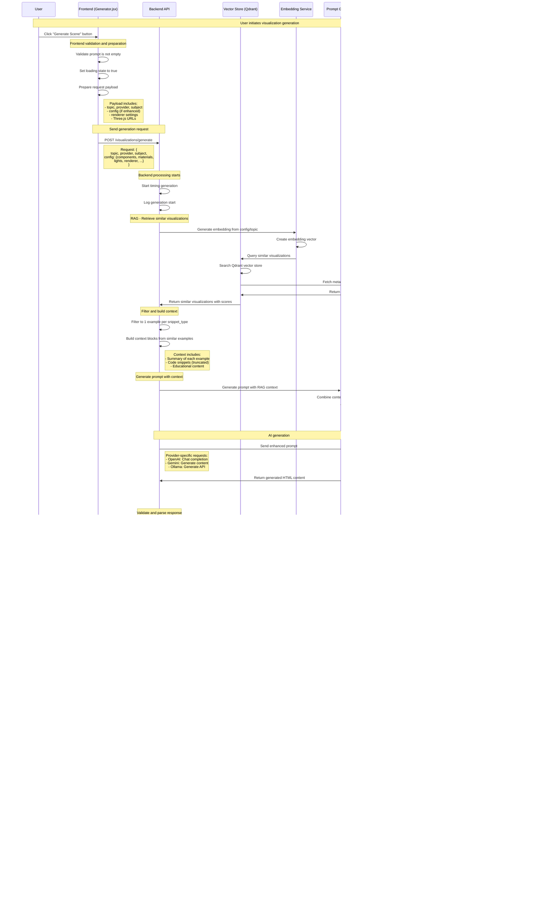

# Generate Visualization Flow

This document describes the sequence of interactions when a user generates a 3D visualization in the 3D Educational Visualization Platform.

## Overview

The generate visualization flow is the core functionality that takes a user's prompt (enhanced or basic) and creates an interactive 3D educational visualization using AI-powered generation and retrieval-augmented generation (RAG).

## Sequence Diagram



## Key Components

### Frontend (Generator.jsx)
- **handleGenerate()**: Main generation function
- **State Management**: Manages `loading`, `html`, and `error` states
- **Request Preparation**: Builds complete request payload with all settings
- **Response Handling**: Displays generated HTML in iframe

### Backend API (/visualizations/generate)
- **RAG Integration**: Retrieves similar visualizations for context
- **Prompt Generation**: Creates comprehensive prompts with examples
- **AI Provider Management**: Handles different AI providers (OpenAI, Gemini, Ollama)
- **Response Validation**: Ensures generated HTML is valid and complete
- **Database Persistence**: Saves prompts and history entries

### Vector Store (Qdrant)
- **Similarity Search**: Finds relevant visualizations based on embedding
- **Metadata Retrieval**: Fetches educational content and code snippets
- **Score Calculation**: Provides similarity scores for ranking

### AI Provider Integration
- **OpenAI**: Uses GPT-4 with chat completion API
- **Gemini**: Uses Google's Gemini with content generation
- **Ollama**: Uses local Ollama with generate API

## RAG (Retrieval-Augmented Generation) Process

1. **Embedding Generation**: Convert user request to vector
2. **Similarity Search**: Find relevant examples in vector store
3. **Context Building**: Create context blocks from similar examples
4. **Prompt Enhancement**: Inject context into generation prompt
5. **Quality Improvement**: Use examples to guide AI generation

## Database Schema

### Prompts Table
```sql
CREATE TABLE prompts (
    id INTEGER PRIMARY KEY,
    topic VARCHAR,
    subject VARCHAR,
    content TEXT,
    key_concepts JSON,
    education_level VARCHAR,
    learning_objectives TEXT,
    interactive_features JSON,
    created_at TIMESTAMP
);
```

### History Table
```sql
CREATE TABLE history (
    id VARCHAR PRIMARY KEY,
    prompt_id INTEGER,
    user_query TEXT,
    response TEXT,
    provider VARCHAR,
    components JSON,
    materials JSON,
    lights JSON,
    render_settings JSON,
    generation_time FLOAT,
    created_at TIMESTAMP
);
```

## Error Handling

- **Empty Prompt**: Frontend prevents generation of empty prompts
- **AI Provider Errors**: Backend handles API failures with specific error messages
- **Invalid HTML**: Backend validates HTML structure and content
- **Network Issues**: Frontend shows user-friendly error messages
- **Database Errors**: Backend handles persistence failures gracefully

## Performance Considerations

- **Generation Time**: Tracked and logged for optimization
- **Context Truncation**: Code snippets limited to 1000 characters
- **Similarity Limits**: Configurable limit for similar visualizations
- **Caching**: Vector store provides fast similarity search
- **Async Processing**: Non-blocking generation with proper state management

## Benefits

1. **Educational Quality**: RAG ensures high-quality educational content
2. **Interactive Features**: Automatically includes relevant interactive elements
3. **Consistent Styling**: Professional 3D rendering with educational focus
4. **History Tracking**: Complete audit trail of generations
5. **Multi-Provider Support**: Flexible AI provider integration
6. **Error Resilience**: Robust error handling and validation 