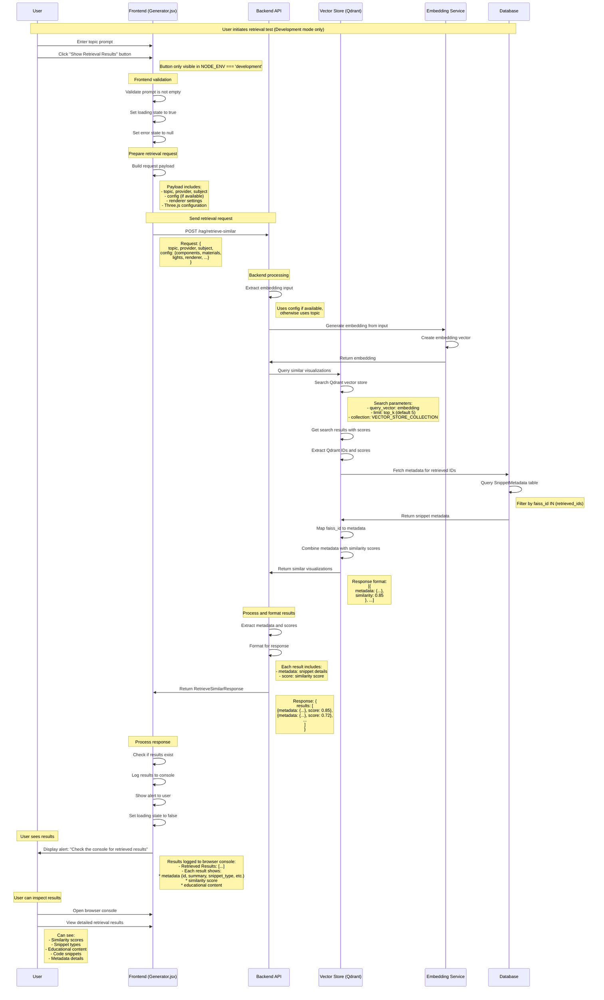

# Show Retrieved Results Flow

This document describes the sequence of interactions when a user views retrieved similar visualizations in the 3D Educational Visualization Platform.

## Overview

The show retrieved results flow is a development/testing feature that allows users to see what similar visualizations the RAG system would retrieve for a given prompt, helping to understand and debug the retrieval-augmented generation process.

## Sequence Diagram



## Key Components

### Frontend (Generator.jsx)
- **handleRetrieveSimilar()**: Main retrieval function
- **Development Mode Check**: Only shows button in development environment
- **Console Logging**: Logs detailed results to browser console
- **User Feedback**: Shows alert to direct user to console

### Backend API (/rag/retrieve-similar)
- **Embedding Generation**: Creates vector from user input
- **Vector Search**: Queries Qdrant for similar items
- **Metadata Retrieval**: Fetches complete metadata from database
- **Score Mapping**: Combines similarity scores with metadata
- **Response Formatting**: Returns structured response with scores

### Vector Store (Qdrant)
- **Similarity Search**: Performs vector similarity search
- **Score Calculation**: Provides cosine similarity scores
- **ID Mapping**: Maps vector IDs to database records

### Database (SnippetMetadata)
- **Metadata Storage**: Stores educational content and snippets
- **ID Linking**: Links Qdrant IDs to metadata records
- **Content Retrieval**: Provides complete snippet information

## Request/Response Format

### Request
```json
{
  "topic": "Ohm's Law electric circuit",
  "provider": "openai",
  "subject": "physics",
  "config": {
    "components": [...],
    "materials": [...],
    "lights": [...],
    "renderer": {...}
  }
}
```

### Response
```json
{
  "results": [
    {
      "metadata": {
        "id": "b6a2beff-ff1a-4278-bb59-400564e6a04a",
        "summary": "Mouse drag controls for moving positive and negative charge spheres",
        "snippet_type": "ui_controls",
        "key_concepts": "Electric charge, Coulomb's law, Electric field",
        "education_level": "High School",
        "html_snippet": "function onMouseDown(event) {...}",
        "created_at": "2025-06-18T10:08:14.809083Z",
        "faiss_id": 18
      },
      "score": 0.85
    },
    {
      "metadata": {
        "id": "17897bf9-9830-4cda-927c-04389aebbf61",
        "summary": "HUD panel toggle button to show or hide controls panel",
        "snippet_type": "ui_controls",
        "key_concepts": "Electric charge, Coulomb's law, Electric field",
        "education_level": "High School",
        "html_snippet": "const hudToggleButton = ...",
        "created_at": "2025-06-18T10:08:14.874884Z",
        "faiss_id": 27
      },
      "score": 0.72
    }
  ]
}
```

## Development Features

### Console Output
The function logs detailed information to the browser console:

```javascript
console.log("Retrieved Results:", data.results);
```

Each result shows:
- **Metadata**: Complete snippet information
- **Score**: Similarity score (0.0 to 1.0)
- **Snippet Type**: Category of the snippet
- **Educational Content**: Key concepts and learning objectives
- **Code Snippets**: HTML/JavaScript code (truncated)

### Development-Only Access
- **Environment Check**: `process.env.NODE_ENV === 'development'`
- **Button Visibility**: Only shows in development mode
- **Debug Information**: Provides detailed debugging data

## Use Cases

1. **RAG Debugging**: Understand what examples the system retrieves
2. **Quality Assessment**: Evaluate similarity search performance
3. **Content Analysis**: Review educational content in vector store
4. **System Tuning**: Optimize embedding and retrieval parameters
5. **Development Testing**: Verify RAG functionality during development

## Error Handling

- **Empty Prompt**: Frontend prevents retrieval of empty prompts
- **Vector Store Errors**: Backend handles Qdrant connection issues
- **Database Errors**: Graceful handling of metadata retrieval failures
- **Network Issues**: Frontend shows user-friendly error messages
- **Invalid Responses**: Validation of response structure

## Performance Considerations

- **Search Limits**: Configurable `top_k` parameter (default: 5)
- **Vector Search**: Fast similarity search in Qdrant
- **Metadata Caching**: Efficient database queries
- **Response Size**: Limited to prevent large payloads
- **Async Processing**: Non-blocking retrieval operations

## Benefits

1. **Development Transparency**: See exactly what RAG retrieves
2. **Quality Assurance**: Verify retrieval relevance and quality
3. **System Understanding**: Understand how embeddings work
4. **Debugging Support**: Identify issues in retrieval process
5. **Performance Monitoring**: Track similarity search effectiveness
6. **Content Validation**: Ensure educational content quality 