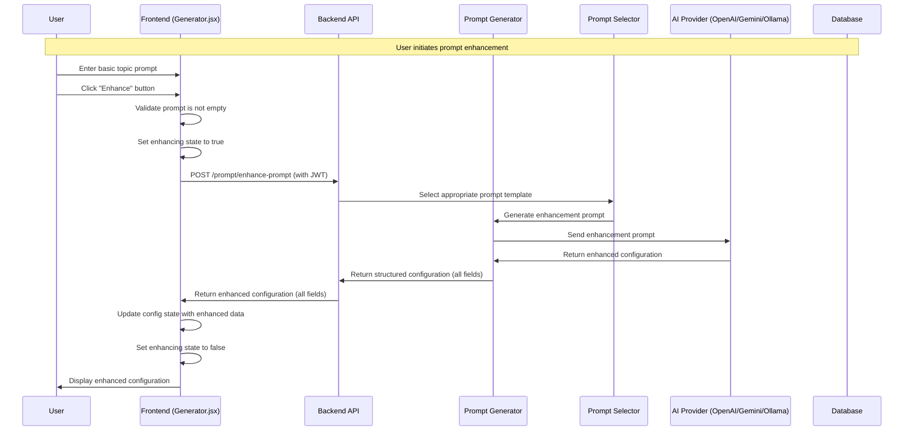

# Enhance Prompt Flow

This document describes the sequence of interactions when a user enhances a prompt in the 3D Educational Visualization Platform.

## Overview

The enhance prompt flow allows users to take a basic topic description and automatically generate a detailed configuration with educational content, interactive features, and rendering settings. The enhanced config now always includes all fields required for visualization generation: components, materials, lights, narration texts, renderer settings, and more.

## Sequence Diagram



## Key Components

### Frontend (Generator.jsx)
- **handleEnhance()**: Main function that orchestrates the enhancement flow
- **State Management**: Manages `enhancing` state and `config` updates
- **Error Handling**: Displays errors if enhancement fails
- **Config Structure**: Expects all fields (components, materials, lights, narration, renderer, etc.)

### Backend API (/prompt/enhance-prompt)
- **Prompt Selector**: Chooses appropriate template based on subject
- **Prompt Generator**: Creates detailed enhancement prompt
- **AI Integration**: Sends request to configured AI provider
- **Response Parsing**: Converts AI response to structured configuration (all fields)
- **Validation**: Ensures all required fields are present in the response
- **Authentication**: Requires Keycloak JWT (unless in dev bypass mode)

### AI Provider Integration
- **OpenAI**: Uses GPT-4 for enhancement
- **Gemini**: Uses Google's Gemini model
- **Ollama**: Uses local Ollama instance

## Configuration Structure

The enhanced configuration always includes:

```json
{
  "topic_name": "Ohm's Law Electric Circuit",
  "key_concepts": ["Voltage", "Current", "Resistance", "Ohm's Law"],
  "education_level": "High School",
  "learning_objectives": [
    "Understand the relationship between voltage, current, and resistance",
    "Visualize how changing resistance affects current flow"
  ],
  "interactive_features": [
    "Adjustable voltage source",
    "Variable resistor",
    "Real-time current measurement"
  ],
  "components": [
    {
      "component_name": "Battery",
      "component_description": "Power source providing voltage to the circuit"
    }
  ],
  "materials": [
    {
      "material_name": "Copper Wire",
      "material_type": "MeshPhongMaterial",
      "color": "#B87333"
    }
  ],
  "lights": [
    {
      "light_type": "AmbientLight",
      "light_class": "AmbientLight",
      "light_color": "#FFFFFF",
      "intensity": 1.0
    }
  ],
  "scene_description": "Interactive 3D electric circuit demonstrating Ohm's Law...",
  "intro_narration_texts": ["Welcome to our Ohm's Law demonstration..."],
  "supporting_narration_texts": ["As we increase the voltage..."],
  "renderer": {
    "antialias": true,
    "shadowMapEnabled": true,
    "toneMapping": "ACESFilmicToneMapping"
  }
}
```

## Error Handling

- **Empty Prompt**: Frontend prevents enhancement of empty prompts
- **AI Provider Errors**: Backend handles API failures gracefully
- **Invalid Response**: Backend validates AI response structure and required fields
- **Network Issues**: Frontend shows user-friendly error messages

## Benefits
1. **Reduced User Effort**: Users don't need to manually configure complex settings
2. **Educational Accuracy**: AI ensures educational content is appropriate
3. **Consistent Quality**: Standardized enhancement process
4. **Interactive Features**: Automatically suggests relevant interactive elements
5. **Professional Rendering**: Optimized renderer settings for educational content 