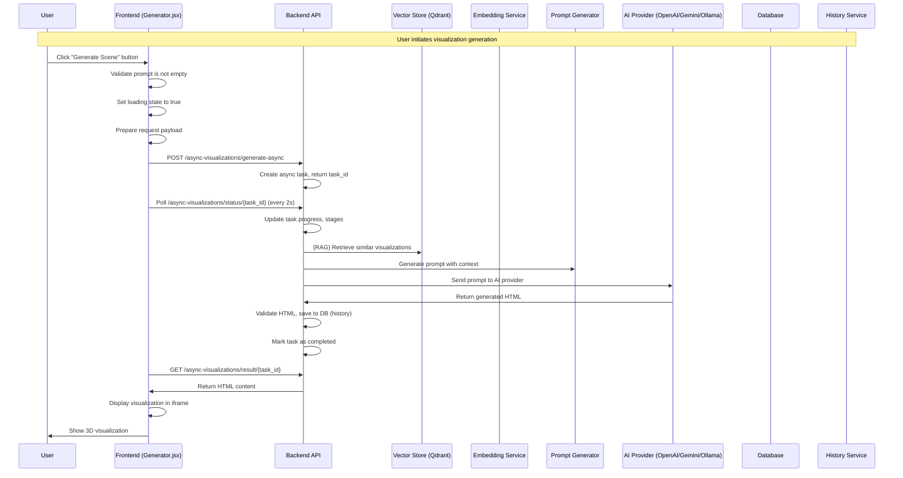

# Generate Visualization Flow

This document describes the sequence of interactions when a user generates a 3D visualization in the 3D Educational Visualization Platform.

## Overview

The generate visualization flow is the core functionality that takes a user's prompt (enhanced or basic) and creates an interactive 3D educational visualization using AI-powered generation and retrieval-augmented generation (RAG). The process is now fully async, using task creation, polling, and result retrieval for scalability and user experience.

## Sequence Diagram



## Async Task Management
- **Task Creation**: Each generation request creates a new async task (task_id)
- **Polling**: Frontend polls for status and progress
- **Cancellation**: User can cancel a running task
- **Result Retrieval**: On completion, frontend fetches the generated HTML

## Key Components

### Frontend (Generator.jsx)
- **handleGenerate()**: Starts async task, polls status, fetches result
- **handleCancelTask()**: Cancels running task
- **State Management**: Tracks loading, progress, error, and config
- **Config Structure**: Full config (components, materials, lights, narration, renderer, etc.)

### Backend API (/async-visualizations/generate-async)
- **Async Task Manager**: Handles task lifecycle
- **RAG Integration**: Retrieves similar visualizations for context
- **Prompt Generation**: Creates comprehensive prompts with examples
- **AI Provider Management**: Handles different AI providers (OpenAI, Gemini, Ollama)
- **Response Validation**: Ensures generated HTML is valid and complete
- **Database Persistence**: Saves prompts and history entries (full config)

### Vector Store (Qdrant)
- **Similarity Search**: Finds relevant visualizations based on embedding
- **Metadata Retrieval**: Fetches educational content and code snippets
- **Score Calculation**: Provides similarity scores for ranking

### AI Provider Integration
- **OpenAI**: Uses GPT-4 with chat completion API
- **Gemini**: Uses Google's Gemini with content generation
- **Ollama**: Uses local Ollama with generate API

## Config Structure (JSON)

Each history entry and generation request uses a full config object:
```json
{
  "topic_name": "Ohm's Law Electric Circuit",
  "key_concepts": ["Voltage", "Current", "Resistance", "Ohm's Law"],
  "education_level": "High School",
  "learning_objectives": ["Understand the relationship between voltage, current, and resistance"],
  "interactive_features": ["Adjustable voltage source", "Variable resistor"],
  "components": [{"component_name": "Battery", "component_description": "Power source"}],
  "materials": [{"material_name": "Copper Wire", "material_type": "MeshPhongMaterial", "color": "#B87333"}],
  "lights": [{"light_type": "AmbientLight", "light_class": "AmbientLight", "light_color": "#FFFFFF", "intensity": 1.0}],
  "renderer": {"antialias": true, "shadowMapEnabled": true, "toneMapping": "ACESFilmicToneMapping"},
  "animation_speed": 1.0,
  "intro_narration_texts": ["Welcome to Ohm's Law!"],
  "supporting_narration_texts": ["Adjust the sliders to see changes."],
  "scene_description": "A 3D scene of a simple electric circuit..."
}
```

## Authentication
- **Keycloak**: All requests require a valid JWT from Keycloak (unless in dev bypass mode)
- **System User**: Used only for migrations/dev if auth is bypassed

## Error Handling
- **Task Errors**: Task status will be "failed" with error message
- **Frontend**: Shows user-friendly error messages and allows retry/cancel
- **Backend**: Handles AI, DB, and validation errors gracefully

## Performance Considerations
- **Async Processing**: Non-blocking, scalable
- **Progress Updates**: Real-time feedback to user
- **Efficient Polling**: 2s interval, stops on completion/failure/cancel

## Benefits
1. **Scalable Generation**: Async tasks allow multiple users and long-running jobs
2. **Rich Config**: All visualization parameters are tracked and auditable
3. **History Tracking**: Complete audit trail of generations
4. **Multi-Provider Support**: Flexible AI provider integration
5. **Error Resilience**: Robust error handling and validation 