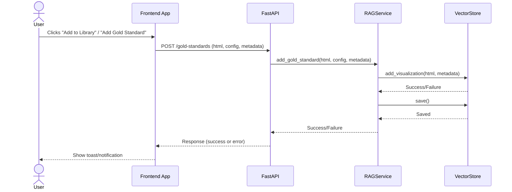

# Enhancement Tasks Based on Architecture Diagram Review

## 1. Implement HTML/JS Validation Microservice

- [ ] Create a Node.js microservice (`HTML_JS_ValidationService`) with the following structure:

  ```
  validator-service/
  ├── index.js
  ├── package.json
  └── Dockerfile (optional)
  ```

- [ ] Use Express for the server, CORS for cross-origin requests, Puppeteer for runtime HTML validation, and Acorn for static JS validation.
- [ ] Implement a `/validate` POST endpoint that:
  - [ ] Accepts `{ html }` in the request body.
  - [ ] Extracts all <script> blocks from the HTML and validates their JS using Acorn (AST parse, catch syntax errors).
  - [ ] Loads the HTML in a headless browser using Puppeteer and captures runtime errors (page errors, console errors).
  - [ ] Returns a JSON response with both static JS errors and runtime errors.
- [ ] Optionally, provide a Dockerfile for easy containerization and deployment.
- [ ] Document how to start the service (e.g., `node index.js` or via Docker).

## 2. Integrate Validation Service with Backend

- [ ] Add backend logic in FastAPI to call the Node validation service after HTML is generated by the LLM.
- [ ] Parse and handle validation results in the backend.

## 3. Implement Retry/Regeneration Logic

- [ ] If validation fails, update backend to:
  - [ ] Rebuild the prompt with error details.
  - [ ] Regenerate HTML (up to MAX_RETRIES env var in settings.py).
  - [ ] Re-validate regenerated HTML.
  - [ ] If still failing, return HTML with a manual review notice.

## 4. Separate Retriever and Reconciler Logic

- [ ] Refactor the current `RAGService` to have explicit `Retriever` (retrieval from vector store) and `Reconciler` (deduplication, scoring, limiting) components/modules, as per the diagram.

## 5. Frontend: Display Validation Feedback

- [ ] Update the frontend to:
  - [ ] Display validation errors and warnings to the user.
  - [ ] Show a manual review notice if persistent errors occur after retries.

## 6. API Documentation and Error Handling

- [ ] Document the new validation and retry flow in the API docs.
- [ ] Ensure clear error messages and status codes for validation failures.

# Gold Standard Addition Flow (Sequence Diagram)




# Gold Standards Flow Enhancement Tasks

## Sample Prompt template

```text
f"""Given the following HTML visualization, analyze it and generate a detailed configuration. 
For each semantically meaningful section of JavaScript (such as lighting, materials, animation, narration, UI controls, renderer settings, camera setup, or any major 3D scene logic), extract the snippet, classify it, and include it in the 'snippets' array in the response JSON.

IMPORTANT: Keep all text fields concise (max 200 characters) to avoid truncation.

{{
    "topic_name": "A short, concise name for the topic (max 20 chars)",
    "key_concepts": "Comma separated main concepts to be visualized (max 200 chars)",
    "education_level": "choose between Elementary, Middle School, High School or College",
    "learning_objectives": "What students will learn (max 200 chars)",
    "interactive_features": "What users can interact with in the scene (max 200 chars)",
    "scene_description": "A detailed description of the 3D scene with realistic details (max 1000 chars)",
    "components": [
        {{
            "component_name": "Name of a 3D component required in the 3D scene (max 50 chars)",
            "component_description": "Description of what this component represents in the 3D scene (max 100 chars)"
        }}
    ],
    "materials": [
        {{
            "material_name": "Name of the material (based on the components)",
            "material_type": "Type of material (choose between MeshStandardMaterial, MeshPhysicalMaterial, MeshPhongMaterial)",
            "color": "#RRGGBB",
            "metalness": 0.5,
            "roughness": 0.5,
            "emissive": "#RRGGBB",
            "emissiveIntensity": 0.5
        }}
    ],
    "lights": [
        {{
            "light_type": "Type of light (max 50 chars)",
            "light_class": "THREE.LightClass [choose between DirectionalLight, AmbientLight, HemisphereLight]",
            "light_color": "#RRGGBB",
            "intensity": 0.5
        }}
    ],
    "interactive_description": "How users can interact with the visualization (max 200 chars)",
    "animated_elements": "What components should be animated and how (max 200 chars)",
    "intro_narration_texts": [
        "Concise introductory narration texts about the topic to be played at the start (each max 500 chars)"
    ],
    "supporting_narration_texts": [
        "Short texts to be played during user interactions explaining controls or feedback (each max 100 chars)"
    ],
    "snippets": [
        {{
            "snippet_type": "lighting | material | animation | narration | ui_controls | renderer_settings | camera_setup | full_scene | miscellaneous",
            "summary": "Short, human-readable description of this snippet's role in the scene (max 100 chars)",
            "embedding_text": "Concise text (~100-200 chars) that describes this snippet for semantic retrieval",
            "html_snippet": "Exact HTML or JS snippet as extracted from the document"
        }}
    ]
}}

HTML Content:
{request.html}

IMPORTANT:
1. Return ONLY the JSON object, no other text or explanation.
2. Keep all text fields concise to avoid truncation.
3. Ensure all JSON fields are properly closed.
4. Do not include any markdown formatting.
5. For each snippet, include both an embedding_text and the exact extracted html_snippet.
6. Analyze the HTML to identify and classify distinct scene components, materials, lights, and other relevant logic.
7. Extract educational content and learning objectives from the visualization.
"""
```

## Multi-File and Snippet-Aware Ingestion
- [ ] Support uploading and processing multiple HTML files in a single request to POST `/gold-standards` (no separate `/analyze` endpoint needed).
- [ ] The POST `/gold-standards` endpoint should accept only HTML files (no metadata or config required in the request body).
- [ ] For each HTML file:
  - [ ] Call the LLM concurrently (not sequentially) using the provided prompt template to extract a structured JSON config and snippets.
  - [ ] Validate the LLM's JSON response against the provided JSON schema. If invalid, retry, log, or report error.
  - [ ] For each snippet in the JSON:
    - [ ] Generate an embedding for (topic + JSON config) using the embedding service.
    - [ ] Add the embedding to the vector store, associating with a unique snippet ID.
    - [ ] Store snippet and file-level metadata (snippet_hash, upload_id, llm_version, timestamps, etc.) in a dedicated metadata store.
  - [ ] On failure, report specific snippet/file errors. Optionally, support upsert/deduplication for existing snippets.

## Backend Service Refactoring
- [ ] Refactor RAG service to clearly separate embedding, vector store, and metadata store responsibilities as in the diagram into separate functions within the same module.
- [ ] Ensure all stores (vector, metadata) are robust to partial failures and support atomicity where possible.

## Error Handling and Reporting
- [ ] Return a detailed success/failure summary to the frontend, including per-file and per-snippet status and errors.
- [ ] Log all LLM, schema validation, and storage errors for traceability.

## Upload Status Tracking
- [ ] Implement logic to allow users to view the status of an upload request to `/gold-standards` (e.g., via a status endpoint or polling mechanism).

## Frontend Feedback
- [ ] Update the frontend to show status/toast notifications for each file and snippet, including errors and ingestion results.
- [ ] Add UI to view the status of a `/gold-standards` upload request.

## Documentation
- [ ] Document the enhanced gold-standards ingestion flow, including prompt template, JSON schema, error handling strategy, and status tracking mechanism. 