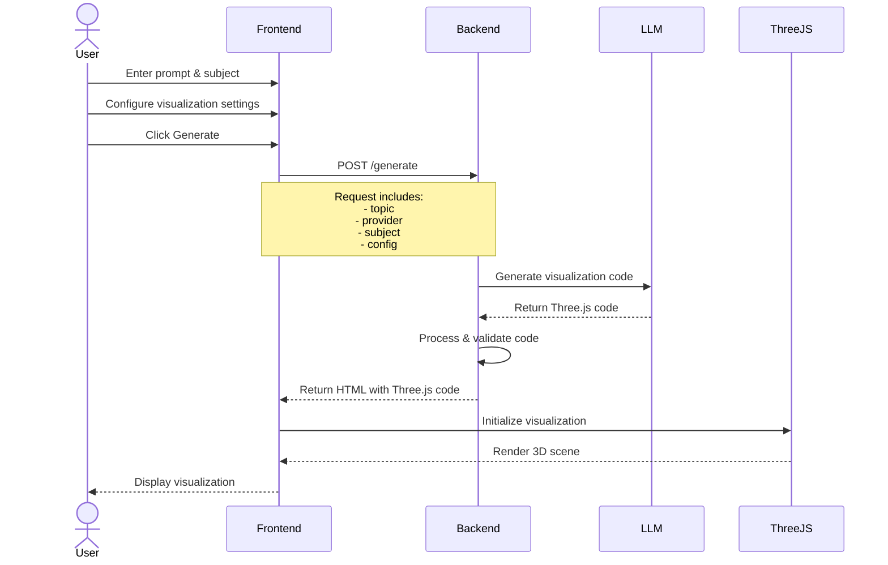
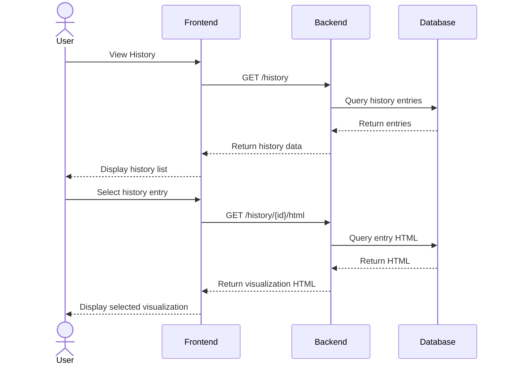
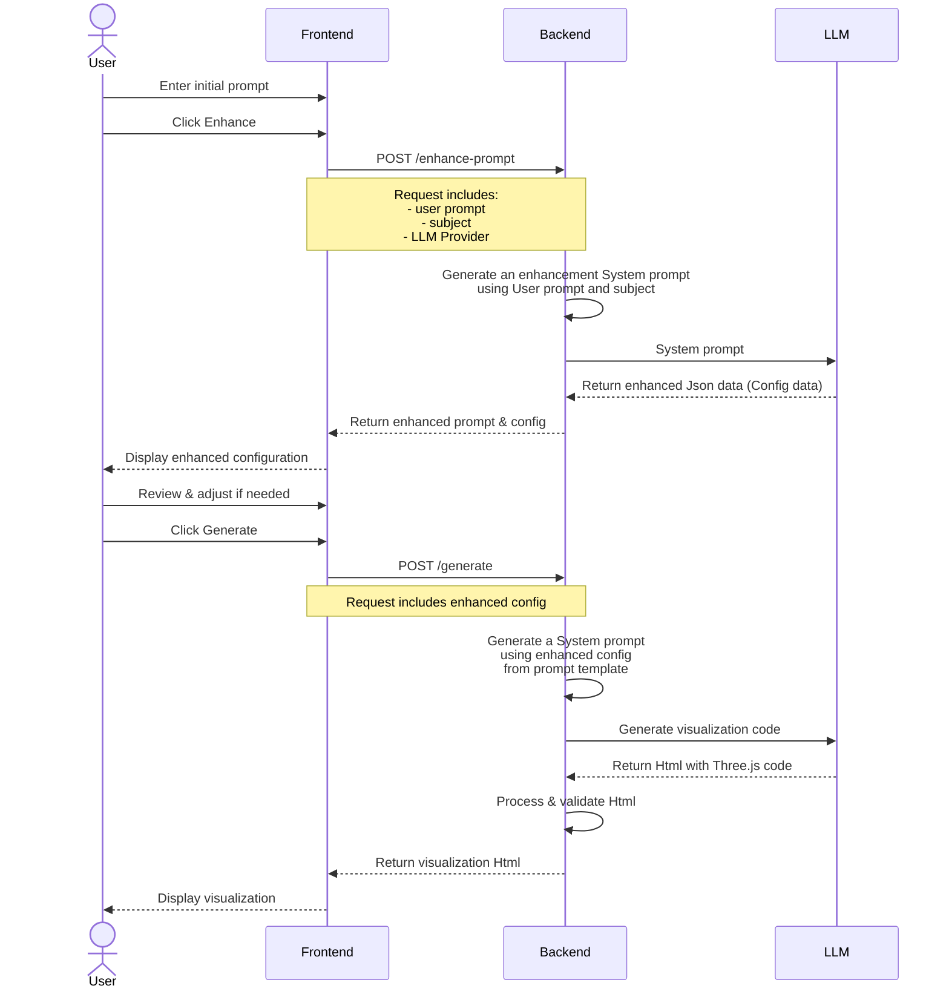
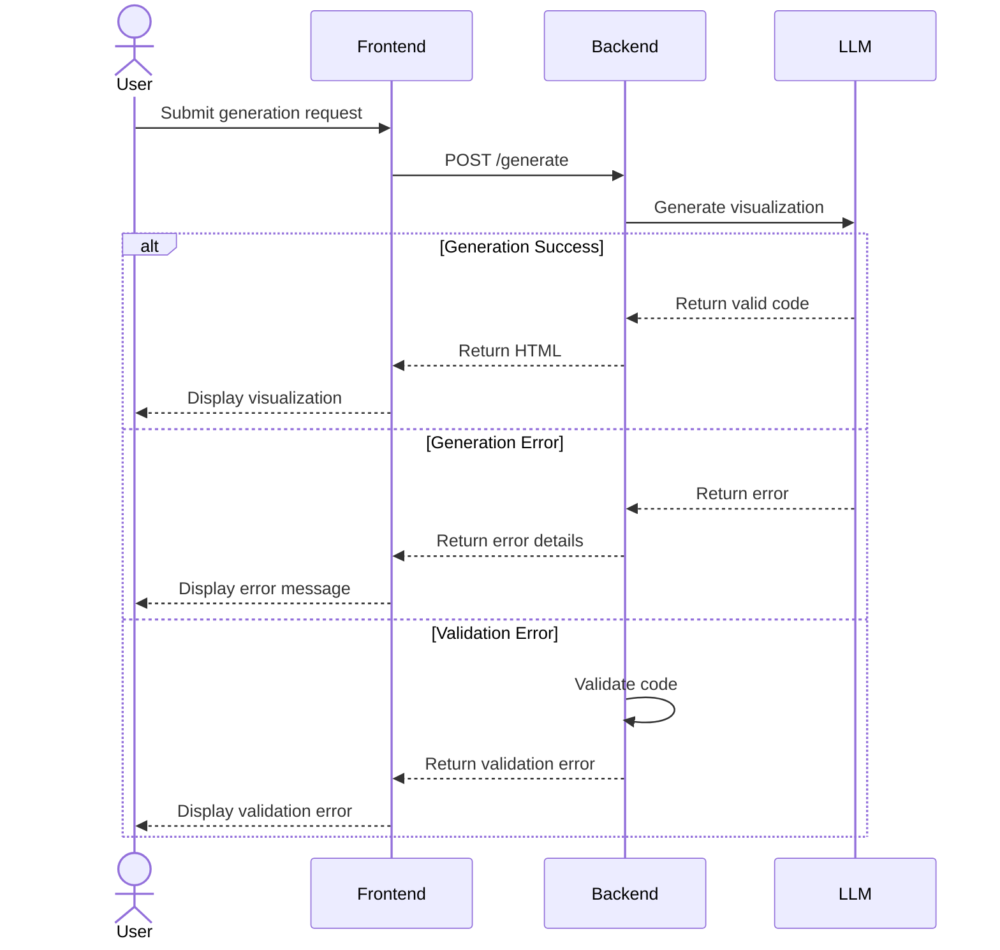
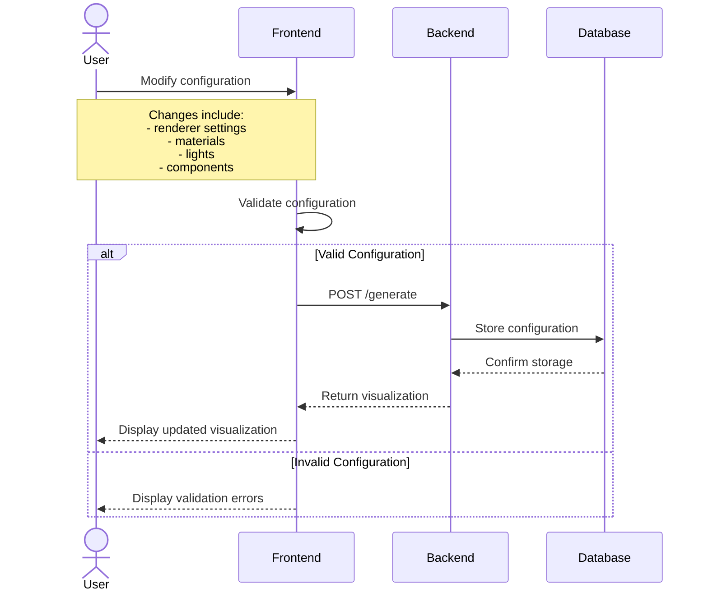

# 3D Visualization System Sequence Diagrams

## Basic Visualization Generation Flow

## History Management Flow

## Prompt Enhancement Flow

## Error Handling Flow

## Configuration Management Flow

## Notes

1. **Renderer Configuration**
   - Uses Three.js v0.155.0
   - Default renderer settings:
     - `antialias: true`
     - `shadowMapEnabled: true`
     - `shadowMapType: "PCFSoftShadowMap"`
     - `outputColorSpace: "SRGBColorSpace"`
     - `toneMapping: "ACESFilmicToneMapping"`
     - `toneMappingExposure: 1.0`

2. **Required Fields**
   - `three_js_url`
   - `orbit_controls_url`
   - `camera_controls`
   - `curve_points`
   - `animation_speed`
   - `tts_language`
   - `tts_rate`
   - `tts_pitch`

3. **Error Handling**
   - Validation errors for missing fields
   - Generation errors from LLM
   - Runtime errors in Three.js code
   - Network errors
   - Database errors 